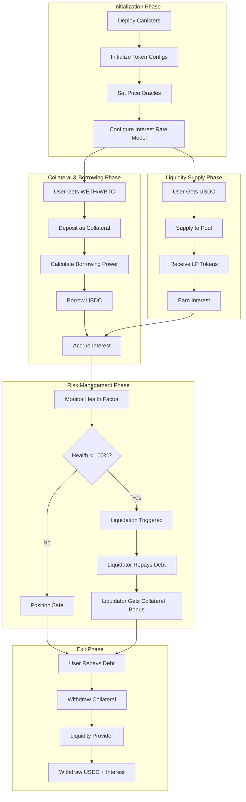
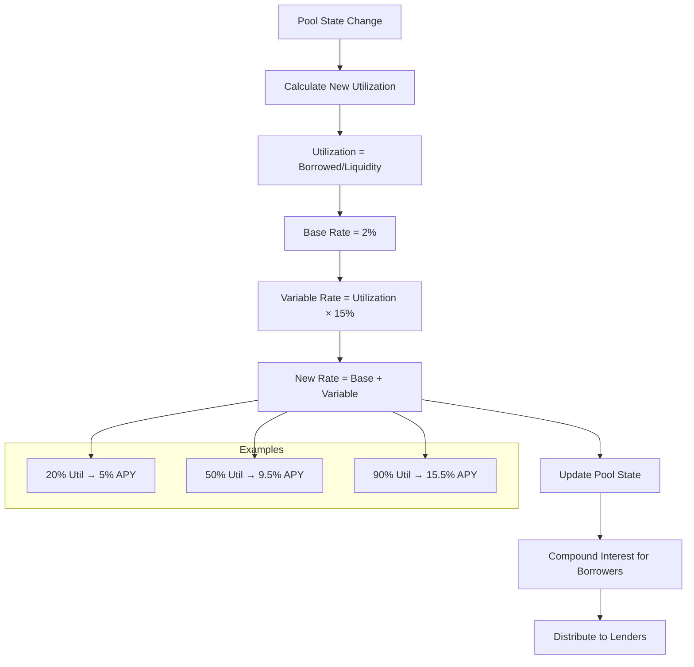
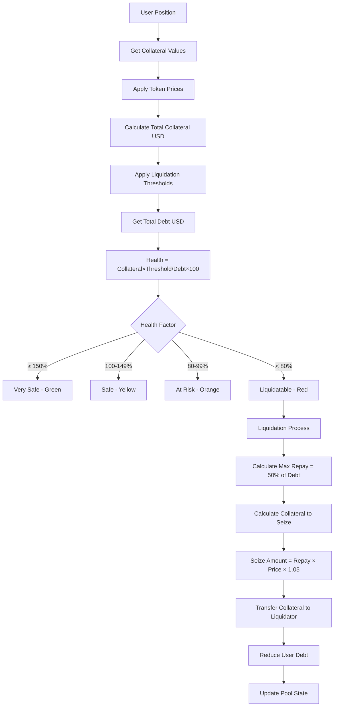
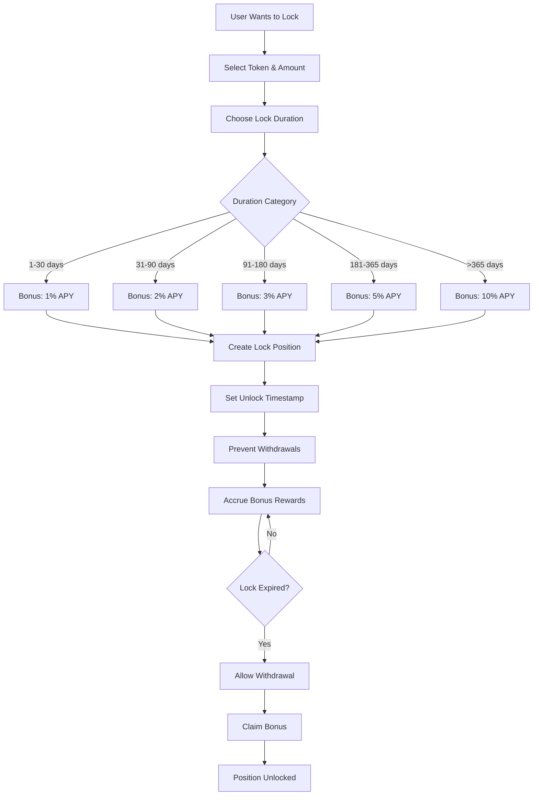
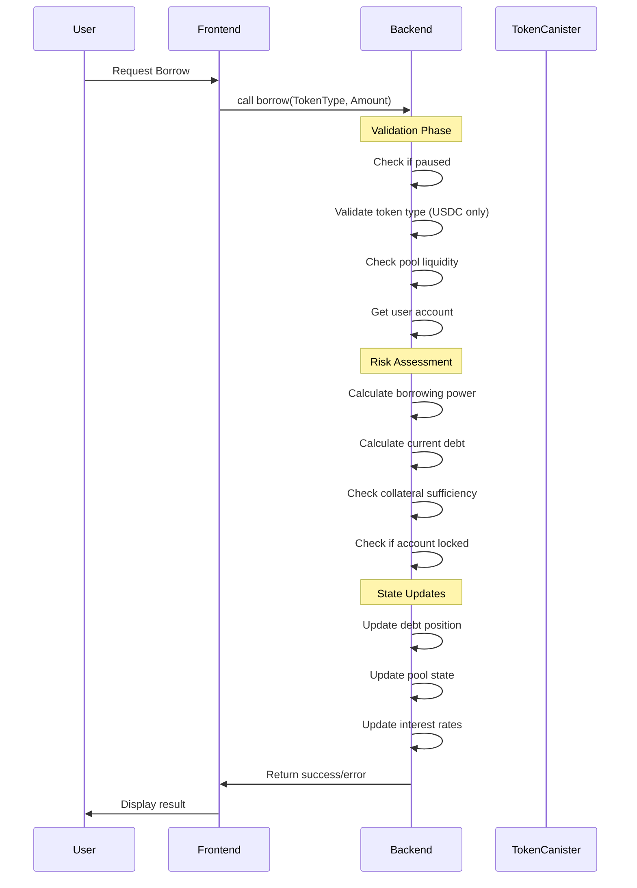
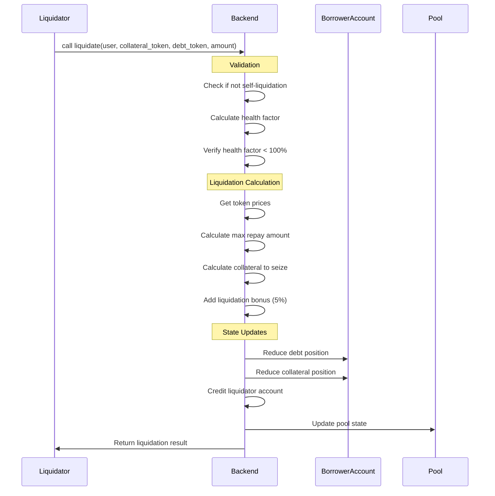

# System Architecture & Flow Diagrams

## 📐 Detailed System Architecture

### Component Interaction Diagram

```
┌─────────────────────────────────────────────────────────────────────────────────┐
│                           ICP Collateral Protocol                               │
│                                                                                 │
│  ┌─────────────┐    ┌──────────────────────────────────────┐    ┌─────────────┐ │
│  │   Users     │    │            Core Backend              │    │  Frontend   │ │
│  │             │    │         (Rust Canister)             │    │   (Vite)    │ │
│  │ ┌─────────┐ │    │                                      │    │             │ │
│  │ │Lenders  │◄┼────┼──┐  ┌─────────────────────────────┐  │    │ ┌─────────┐ │ │
│  │ └─────────┘ │    │  │  │      State Management       │  │    │ │   UI    │ │ │
│  │             │    │  │  │                             │  │    │ │Components│ │ │
│  │ ┌─────────┐ │    │  │  │ ┌─────────┬─────────────────┐ │  │    │ └─────────┘ │ │
│  │ │Borrowers│◄┼────┼──┼──┤ │Accounts │ Pools & Tokens  │ │  │    │             │ │
│  │ └─────────┘ │    │  │  │ └─────────┴─────────────────┘ │  │    │ ┌─────────┐ │ │
│  │             │    │  │  └─────────────────────────────┘  │    │ │Candid UI│ │ │
│  │ ┌─────────┐ │    │  │                                   │    │ └─────────┘ │ │
│  │ │Liquidat.│◄┼────┼──┼──┐ ┌─────────────────────────────┐ │    │             │ │
│  │ └─────────┘ │    │  │  │ │     Business Logic          │ │    └─────────────┘ │
│  └─────────────┘    │  │  │ │                             │ │                    │
│                     │  │  │ │ ┌──────────┬──────────────┐ │ │    ┌─────────────┐ │
│  ┌─────────────┐    │  │  │ │ │Lending   │Liquidation   │ │ │    │Mock Tokens  │ │
│  │             │    │  │  │ │ │Engine    │Engine        │ │ │    │             │ │
│  │ Mock Token  │    │  │  │ │ └──────────┴──────────────┘ │ │    │ ┌─────────┐ │ │
│  │ Canisters   │◄───┼──┼──┤ │                             │ │    │ │  USDC   │ │ │
│  │             │    │  │  │ │ ┌──────────┬──────────────┐ │ │    │ │ Canister│ │ │
│  │ ┌─────────┐ │    │  │  │ │ │Interest  │Token Lock    │ │ │    │ └─────────┘ │ │
│  │ │ Faucet  │ │    │  │  │ │ │Rate Model│Mechanism     │ │ │    │             │ │
│  │ │Functions│ │    │  │  │ │ └──────────┴──────────────┘ │ │    │ ┌─────────┐ │ │
│  │ └─────────┘ │    │  │  │ └─────────────────────────────┘ │    │ │  WETH   │ │ │
│  │             │    │  │  └─────────────────────────────────┘    │ │ Canister│ │ │
│  │ ┌─────────┐ │    │  │                                         │ └─────────┘ │ │
│  │ │ERC20-   │ │    │  │  ┌─────────────────────────────────┐    │             │ │
│  │ │like API │ │    │  └──┤       Query Functions          │    │ ┌─────────┐ │ │
│  │ └─────────┘ │    │     │                                 │    │ │  WBTC   │ │ │
│  └─────────────┘    │     │ ┌────────────┬────────────────┐ │    │ │ Canister│ │ │
│                     │     │ │Account Info│Pool Statistics │ │    │ └─────────┘ │ │
│                     │     │ └────────────┴────────────────┘ │    └─────────────┘ │
│                     │     │                                 │                    │
│                     │     │ ┌────────────┬────────────────┐ │                    │
│                     │     │ │Health      │Token Info      │ │                    │
│                     │     │ │Factor      │& Prices        │ │                    │
│                     │     │ └────────────┴────────────────┘ │                    │
│                     │     └─────────────────────────────────┘                    │
│                     └──────────────────────────────────────────────────────────────│
└─────────────────────────────────────────────────────────────────────────────────┘
```

## 🔄 Detailed Flow Diagrams

### 1. Complete Lending Cycle



### 2. Interest Rate Calculation Flow



### 3. Health Factor Calculation & Liquidation



### 4. Token Lock Mechanism



## 💾 Data Structure Diagrams

### State Management Architecture

```
┌─────────────────────────────────────────────────────────────────┐
│                       Global State                              │
├─────────────────────────────────────────────────────────────────┤
│                                                                 │
│  ┌─────────────────────────────────────────────────────────────┐ │
│  │                   Accounts HashMap                          │ │
│  │                                                             │ │
│  │  Principal → Account {                                      │ │
│  │    ├─ principal: Principal                                  │ │
│  │    ├─ collateral_positions: HashMap<TokenType, Amount>      │ │
│  │    ├─ debt_positions: HashMap<TokenType, Amount>           │ │
│  │    ├─ locked_until: Option<Timestamp>                      │ │
│  │    └─ last_interest_update: Timestamp                      │ │
│  │  }                                                          │ │
│  └─────────────────────────────────────────────────────────────┘ │
│                                                                 │
│  ┌─────────────────────────────────────────────────────────────┐ │
│  │                    Pools HashMap                            │ │
│  │                                                             │ │
│  │  TokenType → LiquidityPool {                               │ │
│  │    ├─ token_type: TokenType                                │ │
│  │    ├─ total_liquidity: Amount                              │ │
│  │    ├─ total_borrowed: Amount                               │ │
│  │    ├─ interest_rate_bps: u64                               │ │
│  │    ├─ utilization_rate_bps: u64                            │ │
│  │    ├─ last_update: Timestamp                               │ │
│  │    └─ cumulative_interest_index: Amount                    │ │
│  │  }                                                          │ │
│  └─────────────────────────────────────────────────────────────┘ │
│                                                                 │
│  ┌─────────────────────────────────────────────────────────────┐ │
│  │                  Token Info HashMap                         │ │
│  │                                                             │ │
│  │  TokenType → TokenInfo {                                   │ │
│  │    ├─ symbol: String                                       │ │
│  │    ├─ decimals: u8                                         │ │
│  │    ├─ price_usd: Amount                                    │ │
│  │    ├─ is_collateral: bool                                  │ │
│  │    ├─ collateral_factor: u64                               │ │
│  │    ├─ liquidation_threshold: u64                           │ │
│  │    └─ liquidation_bonus: u64                               │ │
│  │  }                                                          │ │
│  └─────────────────────────────────────────────────────────────┘ │
│                                                                 │
│  ┌─────────────────────────────────────────────────────────────┐ │
│  │                Lock Positions HashMap                       │ │
│  │                                                             │ │
│  │  Principal → Vec<LockInfo> {                               │ │
│  │    ├─ amount: Amount                                       │ │
│  │    ├─ token_type: TokenType                                │ │
│  │    ├─ lock_duration: u64                                   │ │
│  │    ├─ unlock_time: Timestamp                               │ │
│  │    └─ bonus_rate: u64                                      │ │
│  │  }                                                          │ │
│  └─────────────────────────────────────────────────────────────┘ │
│                                                                 │
│  ┌─────────────────────────────────────────────────────────────┐ │
│  │                   Admin Controls                            │ │
│  │                                                             │ │
│  │  ├─ admin: Option<Principal>                               │ │
│  │  ├─ is_paused: bool                                        │ │
│  │  └─ total_supply: HashMap<TokenType, Amount>               │ │
│  └─────────────────────────────────────────────────────────────┘ │
└─────────────────────────────────────────────────────────────────┘
```

## 🔧 Function Call Flows

### Borrow Function Call Flow



### Liquidation Function Call Flow



## 📊 Performance Metrics

### Key Performance Indicators

```
┌─────────────────────────────────────────────────────────────┐
│                     System Metrics                          │
├─────────────────────────────────────────────────────────────┤
│                                                             │
│  Pool Utilization:     [████████░░] 80%                    │
│  Interest Rate:        12.0% APY                           │
│  Total Liquidity:      $2,500,000 USDC                     │
│  Total Borrowed:       $2,000,000 USDC                     │
│  Available Liquidity:  $500,000 USDC                       │
│                                                             │
│  ┌─────────────────────────────────────────────────────────┐ │
│  │              Collateral Breakdown                       │ │
│  │                                                         │ │
│  │  WETH:  $1,800,000 (60%)  ██████████████████████████░░  │ │
│  │  WBTC:  $1,200,000 (40%)  ███████████████░░░░░░░░░░░░░░  │ │
│  │  Total: $3,000,000                                      │ │
│  └─────────────────────────────────────────────────────────┘ │
│                                                             │
│  ┌─────────────────────────────────────────────────────────┐ │
│  │               Health Factor Distribution                 │ │
│  │                                                         │ │
│  │  Healthy (>150%):     120 positions ████████████████░░  │ │
│  │  Safe (100-150%):     45 positions  █████░░░░░░░░░░░░░░  │ │
│  │  At Risk (80-100%):   12 positions  ██░░░░░░░░░░░░░░░░░░  │ │
│  │  Liquidatable (<80%): 3 positions   ░░░░░░░░░░░░░░░░░░░░  │ │
│  └─────────────────────────────────────────────────────────┘ │
└─────────────────────────────────────────────────────────────┘
```

This comprehensive architecture documentation provides a complete visual understanding of the ICP Collateral Protocol system, including all component interactions, data flows, and state management structures.
