# ICP Collateral Lending Protocol 🚀

[](https://internetcomputer.org/)
[](https://www.rust-lang.org/)
[](https://defiplanet.com/)

## Overview

A decentralized lending and borrowing protocol built on the Internet Computer Protocol (ICP) that enables users to supply liquidity, deposit collateral, and borrow assets with dynamic interest rates and token locking mechanisms.

### 🎯 Key Features

- **Multi-Asset Collateral**: Support for WETH and WBTC as collateral
- **Dynamic Interest Rates**: Rate adjustment based on pool utilization
- **Token Locking**: Lock tokens for bonus rewards (1%-10% APY)
- **Liquidation Protection**: Health factor monitoring and automated liquidation
- **Mock Tokens**: Complete testing environment with faucet functionality

## 🏗️ System Architecture

```
┌─────────────────────────────────────────────────────────────────┐
│                    ICP Collateral Protocol                      │
├─────────────────────────────────────────────────────────────────┤
│                                                                 │
│  ┌─────────────────┐    ┌─────────────────┐    ┌──────────────┐ │
│  │   Mock Tokens   │    │  Core Protocol  │    │   Frontend   │ │
│  │                 │    │                 │    │              │ │
│  │ ┌─────────────┐ │    │ ┌─────────────┐ │    │ ┌──────────┐ │ │
│  │ │ USDC Token  │◄┼────┼►│   Lending   │ │    │ │   Vite   │ │ │
│  │ │ (6 decimals)│ │    │ │   Engine    │ │    │ │    UI    │ │ │
│  │ └─────────────┘ │    │ └─────────────┘ │    │ └──────────┘ │ │
│  │                 │    │                 │    │              │ │
│  │ ┌─────────────┐ │    │ ┌─────────────┐ │    │              │ │
│  │ │ WETH Token  │◄┼────┼►│ Collateral  │ │    │              │ │
│  │ │(18 decimals)│ │    │ │  Manager    │ │    │              │ │
│  │ └─────────────┘ │    │ └─────────────┘ │    │              │ │
│  │                 │    │                 │    │              │ │
│  │ ┌─────────────┐ │    │ ┌─────────────┐ │    │              │ │
│  │ │ WBTC Token  │◄┼────┼►│  Interest   │ │    │              │ │
│  │ │ (8 decimals)│ │    │ │ Rate Model  │ │    │              │ │
│  │ └─────────────┘ │    │ └─────────────┘ │    │              │ │
│  │                 │    │                 │    │              │ │
│  │     Faucet      │    │ ┌─────────────┐ │    │              │ │
│  │   Functions     │    │ │ Liquidation │ │    │              │ │
│  └─────────────────┘    │ │   Engine    │ │    │              │ │
│                         │ └─────────────┘ │    │              │ │
│                         │                 │    │              │ │
│                         │ ┌─────────────┐ │    │              │ │
│                         │ │    Lock     │ │    │              │ │
│                         │ │  Mechanism  │ │    │              │ │
│                         │ └─────────────┘ │    │              │ │
│                         └─────────────────┘    └──────────────┘ │
└─────────────────────────────────────────────────────────────────┘
```

### 📦 Canister Architecture


## 🔄 User Flow Diagrams

### 1. Lender Flow (Supply Liquidity)


### 2. Borrower Flow


### 3. Token Locking Flow


## ⚙️ System Flow

### Interest Rate Calculation

```mermaid
graph LR
    A[Pool Utilization] --> B[Calculate Rate]
    B --> C[Base Rate: 2%]
    C --> D[+ Utilization × 15%]
    D --> E[Final Interest Rate]
    
    subgraph Examples
        F[40% Utilization<br/>= 2% + 6% = 8%]
        G[80% Utilization<br/>= 2% + 12% = 14%]
    end
    
    E --> F
    E --> G
```



### Health Factor Monitoring

```mermaid
graph TD
    A[User Position] --> B[Calculate Collateral Value]
    B --> C[Apply Liquidation Threshold]
    C --> D[Calculate Debt Value]
    D --> E[Health Factor = Collateral×Threshold/Debt×100]
    E --> F{Health Factor ≥ 100%?}
    F -->|Yes| G[Position Safe]
    F -->|No| H[Position at Risk]
    H --> I[Trigger Liquidation]
    I --> J[Liquidator Receives 5% Bonus]
    
    style G fill:#c8e6c9
    style H fill:#ffcdd2
    style I fill:#ff8a80
    style J fill:#fff9c4
```



### Liquidation Process


## 🛠️ Technical Specifications

### Token Configuration

| Token | Symbol | Decimals | Price (USD) | Collateral Factor | Liquidation Threshold | Can Borrow | Can Collateralize |
|-------|--------|----------|-------------|-------------------|----------------------|------------|-------------------|
| USDC  | USDC   | 6        | $1.00       | 0%                | 0%                   | ✅         | ❌                |
| WETH  | WETH   | 18       | $3,000      | 80%               | 85%                  | ❌         | ✅                |
| WBTC  | WBTC   | 8        | $45,000     | 75%               | 80%                  | ❌         | ✅                |

### Interest Rate Model

```
Interest Rate = Base Rate + (Utilization Rate × Multiplier)

Where:
- Base Rate = 2% APY
- Multiplier = 15%
- Utilization Rate = Total Borrowed / Total Liquidity
```

### Lock Bonus Structure

| Duration | Bonus Rate |
|----------|------------|
| 1-30 days | 1% APY |
| 31-90 days | 2% APY |
| 91-180 days | 3% APY |
| 181-365 days | 5% APY |
| >365 days | 10% APY |

## 🚀 Quick Start

### Prerequisites

```bash
# Install dfx
sh -ci "$(curl -fsSL https://internetcomputer.org/install.sh)"

# Start local IC replica
dfx start --background
```

### Deploy the Protocol

```bash
# Clone repository
git clone <repository-url>
cd icp_collateral

# Deploy all canisters
dfx deploy --with-cycles 1000000000000
```

### Get Test Tokens

```bash
# Claim free tokens from faucets
dfx canister call usdc_token faucet    # Get 1,000 USDC
dfx canister call weth_token faucet    # Get 1,000 WETH
dfx canister call wbtc_token faucet    # Get 1,000 WBTC
```

### Basic Usage Example

```bash
# 1. Supply liquidity to earn interest
dfx canister call icp_collateral_backend supply_liquidity '(variant { USDC }, 2000000000)'

# 2. Deposit collateral
dfx canister call icp_collateral_backend deposit_collateral '(variant { WETH }, 1000000000000000000)'

# 3. Check borrowing power
dfx canister call icp_collateral_backend get_borrowing_power '(null)'

# 4. Borrow USDC
dfx canister call icp_collateral_backend borrow '(variant { USDC }, 1000000000)'

# 5. Check health factor
dfx canister call icp_collateral_backend get_user_health_factor '(null)'
```

## 📊 Monitoring & Analytics

### Check Pool Status

```bash
# View all pools
dfx canister call icp_collateral_backend get_all_pools

# View specific pool
dfx canister call icp_collateral_backend get_pool_info '(variant { USDC })'
```

### Account Management

```bash
# View account details
dfx canister call icp_collateral_backend get_account_info '(null)'

# Check lock positions
dfx canister call icp_collateral_backend get_lock_positions '(null)'

# Monitor health factor
dfx canister call icp_collateral_backend get_user_health_factor '(null)'
```

### Token Information

```bash
# Get token configuration
dfx canister call icp_collateral_backend get_token_info '(variant { WETH })'

# Check token balances
USER_PRINCIPAL=$(dfx identity get-principal)
dfx canister call weth_token balance_of "(principal \"$USER_PRINCIPAL\")"
```

## 🧪 Testing

Run the comprehensive test suite:

```bash
# Make test script executable
chmod +x test_script.sh

# Run all tests
./test_script.sh
```

## 🔐 Security Features

- **Health Factor Monitoring**: Continuous position health tracking
- **Liquidation Protection**: Automated liquidation when health factor < 100%
- **Interest Rate Caps**: Maximum interest rate limits
- **Admin Controls**: Emergency pause/unpause functionality
- **Token Locking**: Prevent unauthorized withdrawals during lock period

## 🌐 Network Information

### Local Development
- **Network**: Local IC Replica
- **Port**: 4943
- **Candid UI**: http://127.0.0.1:4943/?canisterId=<candid-ui-canister-id>

### Canister URLs
After deployment, access canisters via:
- **Backend**: `http://127.0.0.1:4943/?canisterId=<candid-ui-canister-id>&id=<backend-canister-id>`
- **Frontend**: `http://<frontend-canister-id>.localhost:4943/`

## 📝 API Reference

### Core Functions

| Function | Type | Description |
|----------|------|-------------|
| `supply_liquidity` | Update | Supply USDC to earn interest |
| `deposit_collateral` | Update | Deposit WETH/WBTC as collateral |
| `borrow` | Update | Borrow USDC against collateral |
| `repay` | Update | Repay outstanding debt |
| `withdraw_collateral` | Update | Withdraw collateral if healthy |
| `lock_tokens` | Update | Lock tokens for bonus rewards |
| `liquidate` | Update | Liquidate unhealthy positions |

### Query Functions

| Function | Type | Description |
|----------|------|-------------|
| `get_account_info` | Query | Get user account details |
| `get_pool_info` | Query | Get specific pool information |
| `get_all_pools` | Query | Get all pool information |
| `get_user_health_factor` | Query | Get position health factor |
| `get_borrowing_power` | Query | Get maximum borrow capacity |
| `get_lock_positions` | Query | Get token lock positions |

## 🛣️ Roadmap

- [ ] Oracle integration for real-time prices
- [ ] Governance token and DAO
- [ ] Flash loan functionality
- [ ] Cross-chain bridges
- [ ] Mobile application
- [ ] Advanced analytics dashboard
- [ ] Automated liquidation bots
- [ ] Insurance pool integration

## 🤝 Contributing

Contributions are welcome! Please feel free to submit a Pull Request.

## 📄 License

This project is licensed under the MIT License - see the [LICENSE](LICENSE) file for details.

## 🔗 Links

- [Internet Computer](https://internetcomputer.org/)
- [IC SDK Documentation](https://internetcomputer.org/docs/current/developer-docs/setup/install/)
- [Candid](https://internetcomputer.org/docs/current/developer-docs/backend/candid/)
- [Rust CDK](https://docs.rs/ic-cdk/)

---

**Built with ❤️ on the Internet Computer**
